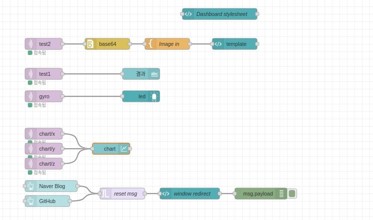

# Node-Red + rp2040 + Teachable Machine Streaming
노드레드 안에서 구동되는 머신 러닝 객체 검출과 센서 값
<!-------------------------------------------------------------Part 1------------------------------------------------------------------------------------------>

## 기능
* **비디오 출력 부**
  1. 헤드폰을 쓴 사진(500장)과 쓰지 않은 사진(500장) 촬영 후 tensorflow를 사용하여 학습하고  
     딥 러닝을 쉽게 할 수 있는 파이썬 라이브러리인 케라스(Keras) 파일로 변환하여 객체 검출 한다.
  2. 다음과 같은 코드로 헤드셋 유무를 판별함
     ```python
        if (prediction[0,0] < prediction[0,1]):
             print("헤드폰 없음")
       

        else:
             print('헤드폰 있음')
     ```
  3. 다음과 같은 코드로 base64로 변환함
     ```python 
        def encode_img(image1):
           success, encoded_img =cv.imencode('.png',image1)
           if success:
               return base64.b64encode(encoded_img)
           return ''
    
        encoded_img=encode_img(image1)
        decoded_img=base64.b64decode(encoded_img)
     ```
* **노드 레드(Node-Red)부**  
      
    1. 다음과 같이 노드를 구성하였고 관련된 Node_import 정보는 [이곳](./Node-Red_import/import_node.md)을 참고 바람  
    2. 
 
* **Rp2040(MicroPyhton)부**
 
 * **MQTT부**  
