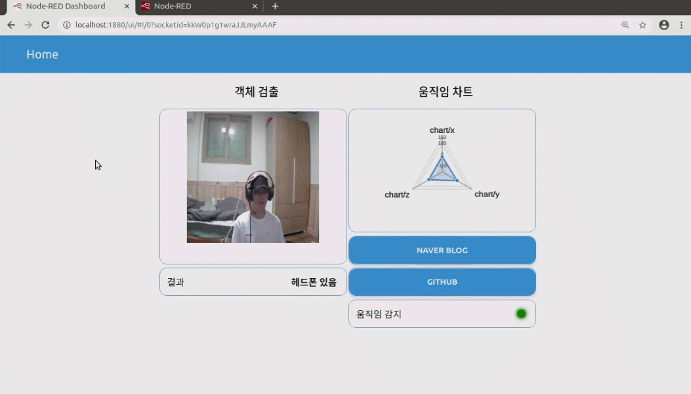

# 노드레드 안에서 구동되는 머신 러닝 객체 검출과 센서 값
임베디드 시스템 응용 기말고사 작품  
Node-Red + rp2040 + Teachable Machine Streaming  
<!-------------------------------------------------------------Part 1------------------------------------------------------------------------------------------>
* #### :family: 팀원
  * 정휘성
  * Git Commit & Push
  
* #### 💡 구동 환경
  * <a href="https://developer.nvidia.com/embedded/jetson-nano-developer-kit" target="_blank">Jetson Nano Developer Kit(4GB)</a>  
  * OS Ver: Ubuntu 20.04 (jetpack)
  * <a href="https://docs.arduino.cc/hardware/nano-rp2040-connect" target="_blank">Rp2040</a>  
  * USB Camera
  * IDE: Pycharm, Thonny, Visual Studio Code

## 블록도
 


## 설명
### **비디오 출력 부**
##
  헤드폰을 쓴 사진(500장)과 쓰지 않은 사진(500장) 촬영 후 tensorflow를 사용하여 학습하고</br>
  머신 러닝을 쉽게 할 수 있는 파이썬 라이브러리인 케라스(Keras) 파일로 변환하여 객체 검출함     
  
  * 다음과 같은 코드로 헤드셋 유무를 판별함  
  
       ```python
          if (prediction[0,0] < prediction[0,1]):
               print("헤드폰 없음")


          else:
               print('헤드폰 있음')
       ```
  * 다음과 같은 코드로 base64로 변환함  
  
       ```python 
          def encode_img(image1):
             success, encoded_img =cv.imencode('.png',image1)
             if success:
                 return base64.b64encode(encoded_img)
             return ''

          encoded_img=encode_img(image1)
          decoded_img=base64.b64decode(encoded_img)
       ```
### **노드 레드(Node-Red)부분**  
##
    
  * 다음과 같이 노드를 구성하였고 관련된 Node_import 정보는 [이곳](./Node-Red_import/import_node.md) 을 참고 바람   
### **노드 레드 대시보드(Node-Red Dashboard)부분**  
##
    
  * 대시보드는 크게 ***객체 검출**과 ***움직임 차트** 부분으로 나누어져 있음  

  * 객체 검출 부분에는 수신 받은 머신 러닝 객체 검출 ***영상을 송출***하고 객체 검출 결과를 ***텍스트***로 출력함  

  * 직임 차트 부분에는 rp2040부터 받은 3축(X,Y,Z) 가속도와 자이로 센서를 받아서 ***3차원 차트***로 출력하며  
     움직임이 감지될 경우 LED로 움직일 경우 ***초록색LED***를 움직이지 않을 경우 ***빨간색LED***로 한눈에 알아 볼 수 있도록 ***시각화 함***
       
  * 두개의 ***버튼***을 구성하고 자바스크립트로 개인 네이버 블로그와 깃허브 주소를 연결하여 ***클릭 시 새창 이벤트***로 열릴 수 있게 함
    
  * Dashboard ***CSS***를 통하여 기존의 딱딱한 노드레드 UI를 깔끔하고 유려하게 바꾸고 사용자 친화적으로 바꿈
### **Rp2040(MicroPyhton)부분**  
##

  1. 가속도와 자이로스코프의 3축(X,Y,Z)을 각 변수에 저장 
    
       ```python
        accel_x, accel_y, accel_z = lsm.read_accel()  
        gyro_x, gyro_y, gyro_z = lsm.read_gyro()  
       ```  
  2. 가속도와 자이로스코프의 3축(X,Y,Z)을 원하는 값으로 만들기 위하여 계산과 반올림을 시켜줌  
    
       ```python 

        accx=round(accel_x,1)  
        acc_x=accx / 16384.0  
        ***  
        gyrox=round(gyro_x,1)  
        ***  
        ```
   3. 각 값의 평균을 계산하기 위해 리스트로 만들고 계산함  
     
       ```python 
        cntx = list([gyrox])  
        ***  
        avgx = sum(cntx,0.0)/len(cntx)  
        ***  
       ```
   4. 계산된 값을 MQTT를 사용하여 Jetson Nano에 송신함  
     
       ```python 
        client.publish('chart/x',"{0}".format(avgx))
        client.publish('chart/y',"{0}".format(avgy))
        client.publish('chart/z',"{0}".format(avgz))
       ```
   5. 움직일 때와 정지 시 범위를 계산하여 MQTT로 값을 Jetson Nano에 송신함  
     
       ```python 
        if (-0.1 >= avgx or 0.1 <= avgx) or (-0.1 >= avgy or 0.1 <= avgy) or (-0.1 >= avgz or 0.1 <= avgz):
           step1 = 0
        if (step1 == 1):
           continue
        if (-10 < avgx < 10) and (-10 < avgy < 10) and (-10 < avgz < 10): #mqtt 빈도를 고려하여 넓게 잡음
           step1 =1
           client.publish(TOPIC,'Stop') 

        else:
           client.publish(TOPIC,'Move')
       ```
 
 ### **MQTT부**  
 ##
   #### Publish 
   * p2040과 객체 검출 영상 및 검출 결과 출력 시 사용
   #### Client
   * 영상 정보와 rp2040의 3축에 대한 값을 수신  
      ```python 
        mqtt=mqtt.Client("Client_ID")
        mqtt.connect("IP",1883)
        mqtt.loop(2)
      ```
<!-------------------------------------------------------------Part 2------------------------------------------------------------------------------------------> 

##
## 구동
>   
> 
> 
##
